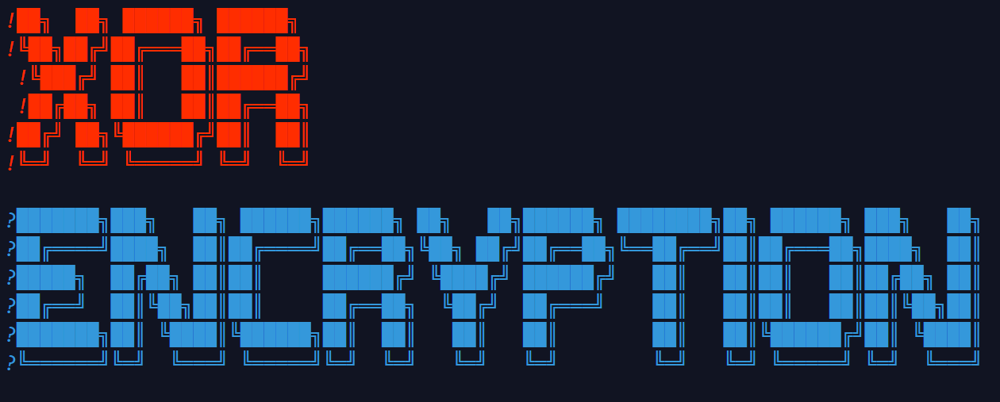

# Message-Encryption-in-C
# 

This is a C program that performs an XOR encryption of a text message.

[](https://replit.com/@Dual-CoreCore/Message-Encryption#main.c)

```c


/* 
 !██╗  ██╗ ██████╗ ██████╗ 
 !╚██╗██╔╝██╔═══██╗██╔══██╗
  !╚███╔╝ ██║   ██║██████╔╝
  !██╔██╗ ██║   ██║██╔══██╗
 !██╔╝ ██╗╚██████╔╝██║  ██║
 !╚═╝  ╚═╝ ╚═════╝ ╚═╝  ╚═╝      
 
 ?███████╗███╗   ██╗ ██████╗██████╗ ██╗   ██╗██████╗ ████████╗██╗ ██████╗ ███╗   ██╗
 ?██╔════╝████╗  ██║██╔════╝██╔══██╗╚██╗ ██╔╝██╔══██╗╚══██╔══╝██║██╔═══██╗████╗  ██║
 ?█████╗  ██╔██╗ ██║██║     ██████╔╝ ╚████╔╝ ██████╔╝   ██║   ██║██║   ██║██╔██╗ ██║
 ?██╔══╝  ██║╚██╗██║██║     ██╔══██╗  ╚██╔╝  ██╔═══╝    ██║   ██║██║   ██║██║╚██╗██║
 ?███████╗██║ ╚████║╚██████╗██║  ██║   ██║   ██║        ██║   ██║╚██████╔╝██║ ╚████║
 ?╚══════╝╚═╝  ╚═══╝ ╚═════╝╚═╝  ╚═╝   ╚═╝   ╚═╝        ╚═╝   ╚═╝ ╚═════╝ ╚═╝  ╚═══╝
                                                                                   
*/


#include <stdio.h>
#include <string.h>
#define MAX_LENGTH 20
#define DASH_LINE puts("+------------------------+")
#define NEW_LINE puts("\n")
/*
 * This is free and unencumbered software released into the public domain.
 *
 * For more information, please refer to <https://unlicense.org>
 */

//Regular text
#define BLK "\e[0;30m"
#define RED "\e[0;31m"
#define GRN "\e[0;32m"
#define YEL "\e[0;33m"
#define BLU "\e[0;34m"
#define MAG "\e[0;35m"
#define CYN "\e[0;36m"
#define WHT "\e[0;37m"

//Regular bold text
#define BBLK "\e[1;30m"
#define BRED "\e[1;31m"
#define BGRN "\e[1;32m"
#define BYEL "\e[1;33m"
#define BBLU "\e[1;34m"
#define BMAG "\e[1;35m"
#define BCYN "\e[1;36m"
#define BWHT "\e[1;37m"

//Regular underline text
#define UBLK "\e[4;30m"
#define URED "\e[4;31m"
#define UGRN "\e[4;32m"
#define UYEL "\e[4;33m"
#define UBLU "\e[4;34m"
#define UMAG "\e[4;35m"
#define UCYN "\e[4;36m"
#define UWHT "\e[4;37m"

//Regular background
#define BLKB "\e[40m"
#define REDB "\e[41m"
#define GRNB "\e[42m"
#define YELB "\e[43m"
#define BLUB "\e[44m"
#define MAGB "\e[45m"
#define CYNB "\e[46m"
#define WHTB "\e[47m"

//High intensty background 
#define BLKHB "\e[0;100m"
#define REDHB "\e[0;101m"
#define GRNHB "\e[0;102m"
#define YELHB "\e[0;103m"
#define BLUHB "\e[0;104m"
#define MAGHB "\e[0;105m"
#define CYNHB "\e[0;106m"
#define WHTHB "\e[0;107m"

//High intensty text
#define HBLK "\e[0;90m"
#define HRED "\e[0;91m"
#define HGRN "\e[0;92m"
#define HYEL "\e[0;93m"
#define HBLU "\e[0;94m"
#define HMAG "\e[0;95m"
#define HCYN "\e[0;96m"
#define HWHT "\e[0;97m"

//Bold high intensity text
#define BHBLK "\e[1;90m"
#define BHRED "\e[1;91m"
#define BHGRN "\e[1;92m"
#define BHYEL "\e[1;93m"
#define BHBLU "\e[1;94m"
#define BHMAG "\e[1;95m"
#define BHCYN "\e[1;96m"
#define BHWHT "\e[1;97m"

//Reset
#define reset "\e[0m"
#define CRESET "\e[0m"
#define COLOR_RESET "\e[0m"


int main(){

    char key[MAX_LENGTH] = "";
    char message[MAX_LENGTH];
    char encrypted_message[MAX_LENGTH];
    char decrypted_message[MAX_LENGTH] = "";
    int i;

    printf(BHMAG "Message User Input" reset "\n");
    DASH_LINE;
    printf("Write your message \n \u2193 \n");  
    printf("Message: ");
    i = 0;
    do{

        message[i++] = getchar();
        if(i > MAX_LENGTH){

            break;
        }

    }while(message[i - 1] != 10);
    message[i] = '\0';
    DASH_LINE;

        NEW_LINE;

    printf(HBLU "Key User Input" reset "\n");
    DASH_LINE;
    printf("Write your key \n \u2193 \n");
    printf("Key: ");  
    i = 0;
    do{

        key[i++] = getchar();
        if(i > MAX_LENGTH){

            break;
        }

    }while(key[i - 1] != 10);
    key[i] = '\0';
    DASH_LINE;
    
        NEW_LINE;


    printf(REDHB "Message Encryption" reset "\n");
    DASH_LINE;
    for(i = 0; i < strlen(message) - 1; i++){

        encrypted_message[i] = message[i] ^ key[i%(strlen(key) - 1)];
    }
    encrypted_message[i] = '\0';
        
    printf("Encrypted Message \n \u2193 \n");
    printf("%s\n",encrypted_message);
    DASH_LINE;

        NEW_LINE;


    printf(BLUHB "Message Decryption" reset "\n");
    DASH_LINE;
    for(i = 0; i < strlen(message) - 1; i++){

        decrypted_message[i] = encrypted_message[i] ^ key[i%(strlen(key) - 1)];
    }
    decrypted_message[i] = '\0';
        
    printf("Decrypted Message \n \u2193 \n");
    printf("%s\n",decrypted_message);
    DASH_LINE;

    return 0;
}
```
